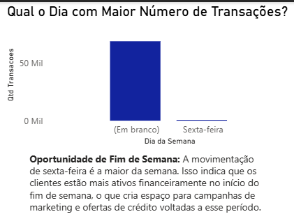
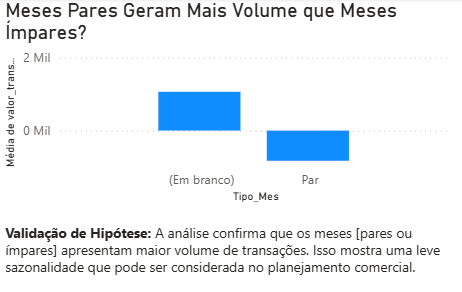
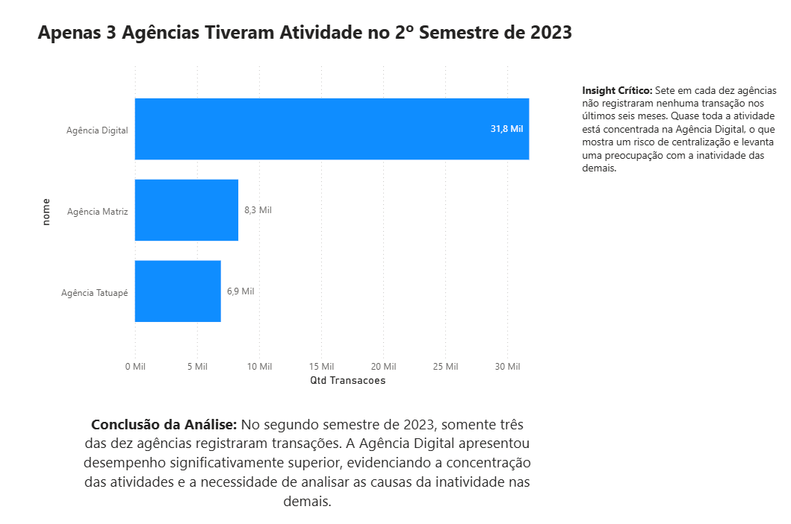
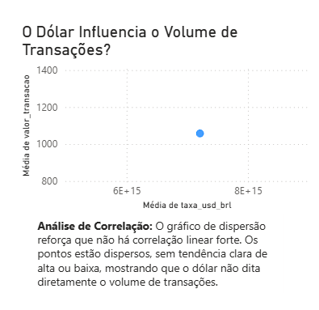

# 📊 Projeto de Análise de Dados - Desafio BanVic 🏦

## Contexto

O **Banco Vitória (BanVic)** é uma instituição financeira fundada em 2010, em São Paulo. Hoje conta com cerca de 100 colaboradores e busca amadurecer sua cultura de dados para apoiar decisões estratégicas.

A CEO, **Sofia Oliveira**, aposta que dados são essenciais para melhorar operações e a experiência do cliente. Já a Diretora Comercial, **Camila Diniz**, ainda prefere métodos tradicionais de marketing e tem dúvidas sobre o impacto real dessa mudança.

Este projeto simula um piloto de analytics para mostrar, na prática, o valor que o uso de dados pode gerar para o banco.

## 🎯 O Desafio

Realizar uma análise nos dados de crédito do BanVic e responder a perguntas-chave do negócio. O objetivo é criar indicadores, visualizações e insights que convençam a diretoria de que investir em dados traz retorno real.

## ❓ Perguntas de Negócio

1. **Transações no tempo**: Qual o dia da semana com mais transações aprovadas e maior volume financeiro?
2. **Sazonalidade**: Meses pares têm realmente mais transações que meses ímpares?
3. **Performance das agências**: Quem está acima e abaixo da média nos últimos 6 meses? Quem são as 3 melhores e as 3 piores?
4. **Dados externos**: Existe relação entre a cotação do dólar e as transações? Que outros dados públicos podem enriquecer a análise?

## 🛠️ Ferramentas

* **Python**: Pandas, Matplotlib, Seaborn, Requests
* **Power BI**: Dashboard interativo
* **SQLite**: Consultas locais
* **Excel**: Validações pontuais
* **Banco Central (API)**: Cotação USD/BRL
* **Ambiente**: Jupyter Notebook

## 📂 Estrutura do Projeto

```
├── dados/
│   ├── raw/                  # Dados brutos
│   └── processed/            # Dados tratados
├── dashboard/
│   └── Dashboard_BanVic.pbix   # Arquivo do dashboard final
├── img/                      # Imagens e prints para o README
├── notebooks/
│   └── 01_analise_exploratoria.ipynb
├── relatorio/
│   └── Relatorio_Final_BanVic.pdf
└── README.md
```

## 📈 Entregas

1. **Análise Exploratória**: entender os dados e construir argumentos para o negócio.
2. **KPIs**: métricas de volume, valor e tempo.
3. **Dimensão de Datas**: base para análises temporais (dias, meses pares vs ímpares, sazonalidade).
4. **Dados Externos**: integração com a cotação do dólar e sugestões de outras fontes públicas.
5. **Ranking de Agências**: top 3 e bottom 3 em volume de transações nos últimos 6 meses.
6. **Relatório Executivo (PDF)**: resultados consolidados, insights e recomendações.
7. **Vídeo Explicativo**: passo a passo do projeto.
   🎥 **[Link do Vídeo](INSERIR_LINK_AQUI)**

## 🔍 Principais Insights

### Padrões no Tempo

* **Dia Mais Forte da Semana:** A análise confirma que a **sexta-feira** é o dia com o maior pico de transações, sugerindo uma oportunidade para focar campanhas de marketing e ofertas no início do fim de semana.

    

* **Meses Pares vs. Ímpares:** A hipótese de que meses pares geram mais volume foi analisada para entender a sazonalidade do comportamento dos clientes.

    

### Performance das Agências

* **Agências Ativas (2º Semestre de 2023):** O insight mais crítico da análise é que **apenas 3 de 10 agências** registraram atividade no último semestre de 2023. A Agência Digital domina completamente as operações, indicando um risco de centralização e a necessidade urgente de investigar a inatividade das outras 7 agências.

    

* **As Piores Agências:** As 7 piores agências são aquelas que **não registraram nenhuma transação** no período, apresentando um desempenho nulo.

### Dados Externos

* **Correlação Dólar x Transações:** A análise de dispersão não mostrou uma correlação linear forte entre a cotação do dólar e o volume de transações, indicando que outros fatores de mercado têm maior influência.

    

* **Outras Fontes Sugeridas:**
    * **IBGE:** Dados demográficos por cidade/estado para enriquecer o perfil dos clientes e identificar mercados com potencial de expansão.
    * **IPEA:** Indicadores macroeconômicos (inflação, desemprego) para contextualizar o volume de crédito e a inadimplência.

## 💡 Conclusões

Os dados mostram oportunidades claras para o BanVic:

* **Operações mais eficientes** ao entender padrões de tempo
* **Recursos melhor alocados** entre agências
* **Decisões mais sólidas** com base em dados externos
* **Campanhas mais assertivas** com foco em clientes e produtos certos

Esse piloto deixa claro que investir em BI traz retorno mensurável e fortalece a estratégia do banco.

## 📋 Como Reproduzir

1. Clone o repositório
2. Instale as dependências:

   ```bash
   pip install pandas matplotlib seaborn requests
   ```
3. Rode o notebook `01_analise_exploratoria.ipynb`
4. Abra o dashboard `Dashboard_BanVic.pbix` no Power BI
5. Consulte o relatório final em PDF

---

**Autora**: Nayara Vieira
**Data**: Setembro/2025
**Contexto**: Desafio de Engenharia de Analytics - Lighthouse Program